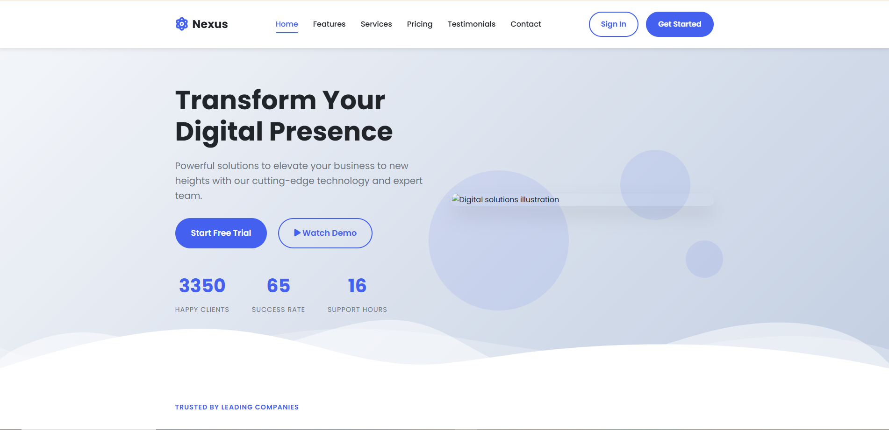

# 🌟 Responsive Landing Page - Nexus Digital Solutions

 *Replace with actual screenshot*

## 📌 Overview

A modern, fully responsive landing page for a digital solutions company built with HTML5, CSS3, and JavaScript. This project showcases clean design principles, responsive layouts, and interactive elements.

## 🚀 Features

- **Responsive Design**: Adapts to all screen sizes (mobile, tablet, desktop)
- **Interactive Components**:
  - Animated counters
  - Testimonial slider
  - Pricing plan toggle
  - FAQ accordion
- **Modern UI Elements**:
  - Gradient backgrounds
  - Card-based layout
  - Custom shapes and dividers
- **Performance Optimized**:
  - Semantic HTML
  - Efficient CSS
  - Minimal JavaScript

## 🛠️ Technologies Used

## 📂 Project Structure
